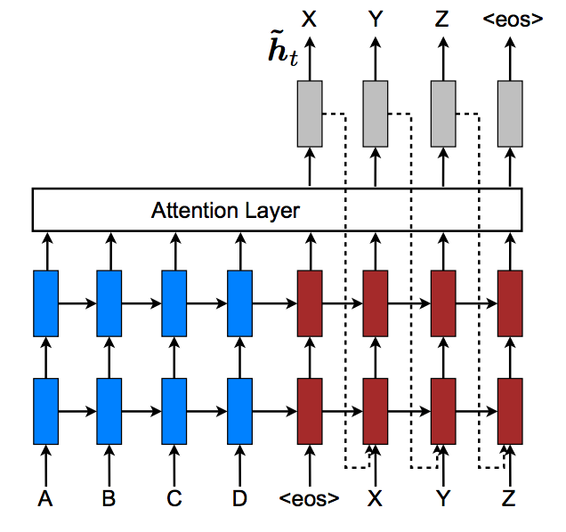

# Neural Question Generation: Learning to Ask

This projects aims at exploring automatic question generation from sentences in reading comprehension passages, conditioned on answers, using deep neural networks.

More precisely, given a sequence of words S = *w1*, *w2*, ..., *wn*, the source sentence, and an answer span A = *wk*, ..., *wk+j*, a span in S, we want to generate a sequence of words Q = *q1*, *q2*, ..., *qm*, a question related to S and whose answer is A. 

We can interpret this task as the reverse objective of Question Answering, where given a sentence and a question, we build an algorithm to find the answer.

# Model Architecture

# Code Organization

    ├── config.py          <- Configuration file with data directories and hyperparamters to train the model
    ├── preprocessing.py   <- Preprocess the input text files, building datasets and vocabularies for model training
    ├── layers.py          <- Define the various layers to be used by the main model
    ├── make_dataset.py    <- Download the SquAD and NewsQA datasets we use for this experiment
    ├── model.py.          <- Define the Seq2Seq model architecture, with an encoder and a decoder
    ├── requirements.txt   <- Required Python libraries to build the project
    ├── train.py           <- Train the model
    ├── utils.py           <- Group a bunch of useful functions to process the data

# Results

# Set-Up

* Clone the repository
* Create a directory for your experiments, logs and model weights: `mkdir output`
* Download GloVE word vectors: https://nlp.stanford.edu/projects/glove/
* Modify the `config.py` file to set up the paths where your GloVE, SquAD and NewsQA datasets, models will be located
* Create a Python virtual environment, source to it: `mkvirualenv qa-env ; workon qa-env` if you use virtualenvwrapper
* Install the dependencies: `pip install -r requirements.txt ; python -m spacy download en`
* Run `python make_dataset.py` to download SquAD and NewsQA datasets, and join the two into single files
* Run `python preprocessing.py` to preprocess the data
* Run `python train.py` to train the model with hyper-parameters found in `config.py`

# Next Steps
 
- [ ]

# Resources

* SQuAD dataset: https://arxiv.org/abs/1606.05250
* NewsQA dataset: https://datasets.maluuba.com/NewsQA
* GloVE: https://nlp.stanford.edu/projects/glove/
* Learning to Ask: Neural Question Generation for Reading Comprehension by Xinya Du, Junru Shao, Claire Cardie: http://arxiv.org/abs/1705.00106
* Machine Comprehension by Text-to-Text Neural Question Generation by Xingdi Yuan, Tong Wang, Caglar Gulcehre, Alessandro Sordoni, Philip Bachman, Sandeep Subramanian, Saizheng Zhang, and Adam Trischler: https://arxiv.org/pdf/1705.02012.pdf